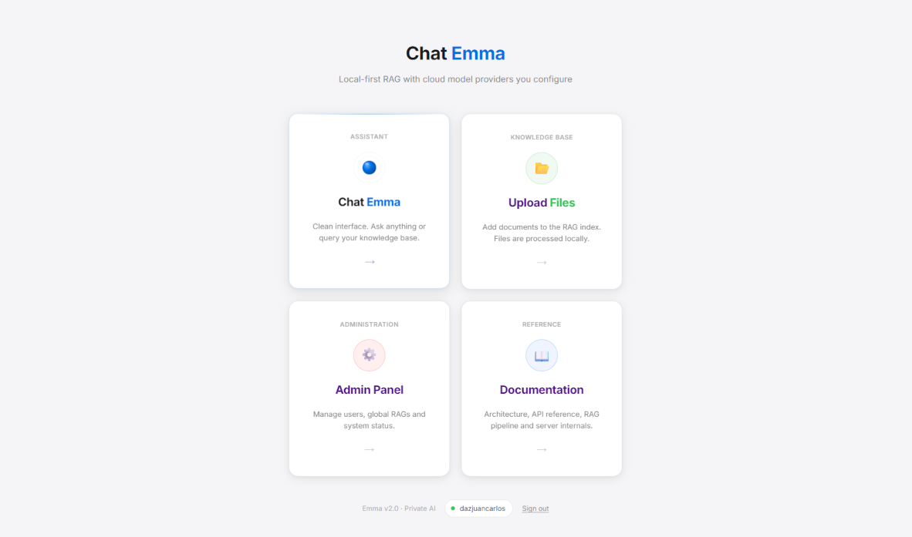

# Emma - Local-First AI With RAG

Emma is a FastAPI chat application with local RAG storage, user roles, document ingestion, inconsistency detection, and a model selector backed by LangChain.

The app keeps documents, chunks, users, conversations, and local state on your machine. Model calls use the API providers you configure, such as Gemini, OpenAI, or Anthropic.




---

## What Is This?

Emma lets users upload `.txt` documents, split them into local RAG chunks, detect likely contradictions between visible RAGs, and ask grounded questions through the selected AI model.

Current backend capabilities:

- FastAPI backend with SQLite persistence.
- Role-based access control with `admin`, `user`, and `read_only`.
- Local document storage in `files/`.
- Local JSON chunk storage in `chunks/`.
- LangChain chat model integration for Gemini, OpenAI, and Anthropic.
- UI model selector based on the API keys available to the backend.
- Upload-time inconsistency detection using the selected provider pipeline.
- Conversational RAG that sends all visible chunks to the selected model instead of using a fixed top-k limit.

Current role model:

- `admin`: can manage users and all RAGs, including global and user-owned RAGs.
- `user`: can use chat and manage their own `mine` RAGs.
- `read_only`: can use chat only and cannot access upload.

Every response is expected to tag its grounding:

- `[RAG]` - answer is based on the uploaded documents.
- `[DRIFT]` - answer includes model knowledge beyond the documents.
- `[NO INFO]` - the documents do not contain enough information.

---

## Requirements

- Python 3.11+
- A virtual environment
- At least one API key for a supported provider:
  - Gemini
  - OpenAI
  - Anthropic

Ollama is not required for the current rebuilt path.

---

## Installation

### 1. Clone The Repository

```bash
git clone https://github.com/yourusername/emma-rag.git
cd emma-rag
```

### 2. Create A Virtual Environment

```bash
python -m venv .venv
```

Activate it:

- Windows: `.venv\Scripts\activate`
- Mac/Linux: `source .venv/bin/activate`

### 3. Install Dependencies

```bash
pip install -r requirements.txt
```

---

## Configure API Keys

Create a local file named `api_keys.json` in the repository root. This file is ignored by Git and is the recommended place for provider credentials.

Example with fake keys:

```json
{
  "gemini": {
    "api_key": "replace-with-your-gemini-api-key"
  },
  "openai": {
    "api_key": "replace-with-your-openai-api-key"
  },
  "anthropic": {
    "api_key": "replace-with-your-anthropic-api-key"
  }
}
```

Only include the providers you actually want to use. For example, if you only use Gemini, this is enough:

```json
{
  "gemini": {
    "api_key": "replace-with-your-gemini-api-key"
  }
}
```

The backend uses `api_keys.json` to decide which providers and models are available in the UI selector. It does not expose the actual API key values to the frontend.

Environment variables are also supported:

- `GEMINI_API_KEY` or `GOOGLE_API_KEY`
- `OPENAI_API_KEY`
- `ANTHROPIC_API_KEY`

---

## Running Emma

### Windows

Double-click `run.bat` or run it from the terminal:

```bat
run.bat
```

### Manual Run

```bash
python -m uvicorn server:app --reload --port 8000
```

Then open:

```text
http://localhost:8000/ui/login.html
```

If the database is empty, the backend bootstraps a default admin user:

```text
username: admin
password: admin1234
```

---

## Project Structure

```text
emma-rag/
|-- server.py           # Active FastAPI backend
|-- server_legacy.py    # Historical reference backend
|-- prompts.py          # Canonical prompt builders
|-- requirements.txt    # Python dependencies
|-- run.bat             # Windows launcher
|-- test.bat            # Test sequencer
|-- api_keys.json       # Local API credentials, ignored by Git
|-- emma.db             # SQLite database
|-- files/              # Uploaded user/global .txt documents
|-- chunks/             # Auto-generated JSON chunks and conflict indexes
|-- tests/              # Unit tests
`-- ui/
    |-- index.html      # Home
    |-- login.html      # Authentication
    |-- chat.html       # Chat UI
    |-- admin.html      # Admin panel
    |-- Docs.html       # Built-in project documentation
    `-- upload.html     # RAG manager
```

Do not commit real API keys or local runtime database changes unless that is explicitly intended.

---

## Core Routes

- `http://localhost:8000/ui/login.html` - login screen
- `http://localhost:8000/ui/index.html` - main home
- `http://localhost:8000/ui/chat.html` - chat UI
- `http://localhost:8000/ui/upload.html` - RAG management
- `http://localhost:8000/ui/admin.html` - admin panel
- `http://localhost:8000/ui/Docs.html` - built-in documentation

---

## Adding Documents

1. Open `http://localhost:8000/ui/upload.html`.
2. Drag and drop a `.txt` file.
3. The server chunks the document and stores local JSON chunk files.
4. The server checks the new document for likely inconsistencies against visible RAGs.
5. The document becomes available to chat without restarting the server.

If Emma detects likely contradictions, the upload page shows the persisted inconsistency details and marks the file with a conflict state.

Permissions:

- `admin` can upload global RAGs and manage all stored RAGs.
- `user` can upload and delete only their own `mine` RAGs.
- `read_only` cannot access upload.

---

## How RAG Works Now

```text
User question
      v
Backend loads all chunks visible to the user
      v
Backend builds the RAG prompt from prompts.py
      v
Selected LangChain chat model generates the answer
      v
Response is tagged with [RAG] / [DRIFT] / [NO INFO]
```

This rebuilt flow intentionally does not use a fixed "top 3 chunks" limit. The model receives the visible chunk set and decides which parts are useful for the answer.

---

## Privacy

Emma is local-first, not fully offline.

Local:

- Uploaded documents
- Chunks
- Users
- Conversations
- SQLite database

Sent to the configured provider API:

- The user question
- Conversation context needed for the request
- RAG chunk content included in the prompt

Use providers and keys appropriate for the sensitivity of your documents.

---

## Tests

Run the test sequencer:

```bat
test.bat
```

Or run unit tests directly:

```bash
python -m unittest discover tests
```

The tests mock provider calls and focus on backend behavior, permissions, RAG ingestion, conflict persistence, and conversation functionality.

---

## Current Technical Notes

- `server.py` is still the active backend boundary and remains fairly compact for now.
- `server_legacy.py` is only a reference for the old implementation.
- `prompts.py` is the canonical place for active prompt builders.
- FastAPI may show an `on_event` deprecation warning until startup is migrated to lifespan handlers.
- `emma.db` often reflects local working state and should not be committed casually.

---

## License

MIT - free to use, modify, and distribute.
